# How to Make Sure Your Charts Are Worth a Thousand Words
Jameson Marriott
May 6, 2025

## Introduction

This post provides the code required to generate the graphs from my
presentation at the World Conference on Quality and Improvement on May
6, 2025 in Denver, CO.

Before you can run anything, you will need to [install
R](https://cran.rstudio.com/), and I recommend that you [install
RStudio](https://posit.co/download/rstudio-desktop/). You can find
instructions on installing these at the links I provided, or you can
find a plethora of resources with a simple search online.

Once you have those installed, the easiest way to run the code will be
do download the quarto file from github and open it with RStudio. From
there you can easily run code chunks or the entire file. Again, there
are a lot of resources on how to do this, but this page might be a good
place to start:
(https://quarto.org/docs/get-started/hello/rstudio.html)\[https://quarto.org/docs/get-started/hello/rstudio.html\].

If this is your first exposure to code, or the first in a long time, the
initial steps can feel overwhelming. You might want to find a course
that covers the basics of R before you get too far. One of my favorite
beginging resources that I still refer to from time to time is (R for
Data Science)\[https://r4ds.hadley.nz/\], which is available for free
online or you can purchase a hard copy. Don’t be scared of the “data
science” in the title. This is very approachable for a beginer and will
help you get up to speed quickly.

------------------------------------------------------------------------

> Graphical excellence is that which gives to the viewer the greatest
> number of ideas in the shortest time with the least ink in the
> smallest space.
>
> –<cite>The Visual Display of Quantitative Information, Edward R. Tufte
> (2006) pg. 51</cite>

<div class="notes">

We are going to look at technical correctness, but also at leaning out
graphics to make them communicate the underlying data with a minimal
amount of “chart junk.”

</div>

<!-- > On inspecting any one of these charts attentively, a sufficiently distinct impression will be made, to remain unimpaired for a time, and the idea which does remain will be simple and complete, at once including the duration and the amount. -->
<!-- > -->
<!-- > --<cite>The Commercial and Political Atlas, William Playfair (1786)</cite> -->

``` r
library(tidyverse)
library(readxl)
library(ggthemes)
library(scales)
library(colorBlindness)

# wcqi_template <- officer::read_pptx(
#   "wcqi_2025_template.pptx"
#   )
# 
# add_content_slide <- function(content, title) {
#   wcqi_template |>
#     add_slide(layout = "blue_title_and_content", master = "Office Theme 2013 - 2022") |>
#     ph_with(title, location = ph_location_label("Title 1")) |>
#     ph_with(content, location = ph_location_label("Text Placeholder 23"))
# }
```

``` r
white_flour_cost <- read_excel("SeriesReport-20250218224807_b50c0a.xlsx", 
    skip = 9) |>
  pivot_longer(-Year, names_to = "Month", values_to = "dollars") |>
  mutate(dollars = case_when(is.na(dollars) ~ (lag(dollars) + lead(dollars)) / 2,
                         TRUE ~ dollars)) |>
  group_by(Year) |>
  summarise(dollars = mean(dollars)) |>
  ungroup() |>
  mutate(Year = ymd(paste(Year, "-01-01")))

plot_flour_cost <- function(data, limits = c(NA, NA), ratio = NA) {
  p <- data |>
    ggplot(aes(x = Year, y = dollars)) +
    geom_line() +
    ylab("Average Annual Cost") +
    labs(title = "Annual Average Dollars per Pound of White Flour in USA", 
         caption = "Source: bls.gov") +
     scale_y_continuous(labels = scales::label_currency(),
                        limits = limits) +
    theme_minimal() +
    theme(axis.title.x = element_blank(),
          text = element_text(size = 24),
          plot.title.position = "plot",
          plot.caption.position = "plot")
  
  if (!is.na(ratio)) {
    p <- p + coord_equal(ratio = ratio)
  }
  
  p
}

flat_flour_cost <- plot_flour_cost(white_flour_cost, c(0, 10))

flat_flour_cost
```

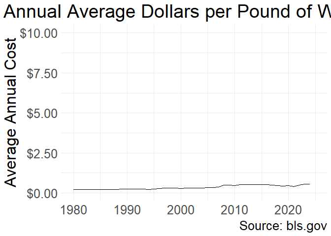

``` r
# add_content_slide(flat_flour_cost, "Axis Zoom")

# plot_flour_cost(white_flour_cost, ratio = 1e3, limits = c(NA, 10))

steep_flour_cost <- plot_flour_cost(white_flour_cost, ratio = 5e4) +
  theme(plot.title = element_text(hjust = .5))

steep_flour_cost
```

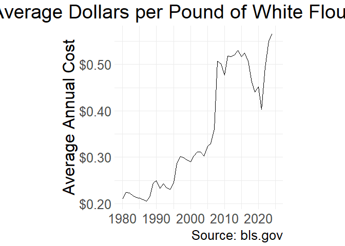

``` r
# add_content_slide(steep_flour_cost, "Axis Zoom")

default_limits_flour_cost <- plot_flour_cost(white_flour_cost, limits = c(NA, NA))

default_limits_flour_cost
```

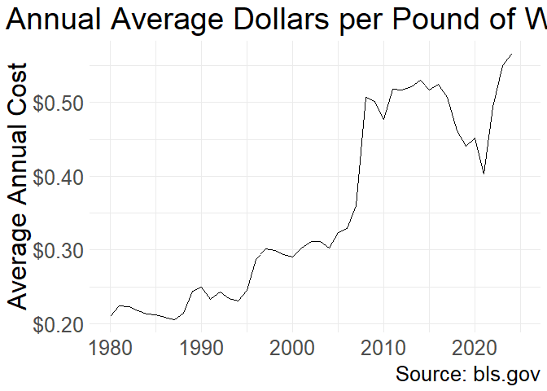

``` r
# add_content_slide(default_limits_flour_cost, "Axis Zoom")

include_zero_flour_cost <- plot_flour_cost(white_flour_cost, limits = c(0, .6))

include_zero_flour_cost
```

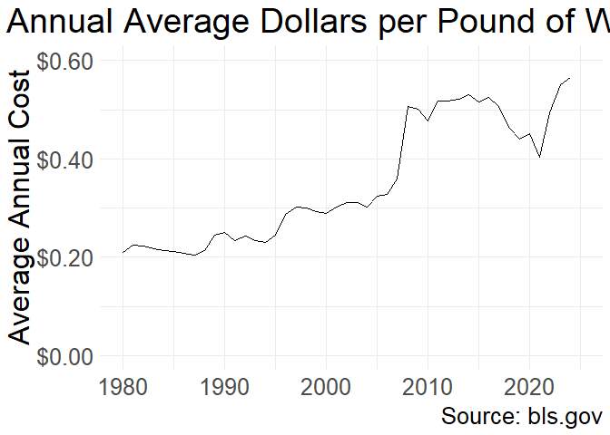

``` r
# add_content_slide(include_zero_flour_cost, "Axis Zoom")
```

``` r
cpi_series <- read_delim("ap.series.txt",
                         delim = "\t",
                         trim_ws = TRUE)

full_cpi <- read_delim(
  "ap.data.0.Current.txt",
  delim = "\t",
  escape_double = FALSE,
  trim_ws = TRUE, 
  guess_max = 1e5
) |>
  left_join(cpi_series, by = "series_id") |>
  filter(area_code == "0000") |>
  #group_by(year, series_title) |>
  #summarise(cpi = mean(value),
  #          n = n()) |>
  #ungroup() |>
  mutate(#cpi = cpi - 1, 
         year = ymd(paste(year, "-", str_extract(period, "\\d{2}"), "-01")),
         cost = as.numeric(value)) #|>
  #filter(n == 12)
  

too_many_color <- full_cpi |>
  ggplot(aes(x = year, y = cost, color = series_title, group = series_title)) +
  geom_line() +
  labs(title = "Consumer Price Index",
       subtitle =  "U.S. city average, average price, not seasonally adjusted",
       caption = "Source: bls.gov") +
  scale_y_continuous(labels = label_dollar()) +
  theme_minimal() +
  theme(legend.position = "none",
        axis.title = element_blank(),
        text = element_text(size = 24),
        plot.title.position = "plot",
        plot.caption.position = "plot")

too_many_color
```

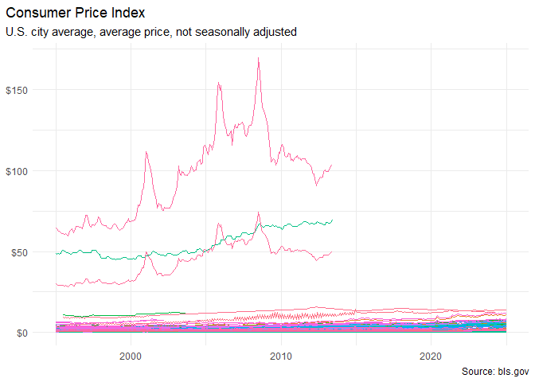

``` r
# add_content_slide(too_many_color, "Legends and Colors")

too_many_color_log <- full_cpi |>
  ggplot(aes(x = year, y = cost, color = series_title, group = series_title)) +
  geom_line() +
  labs(title = "Consumer Price Index",
       subtitle =  "U.S. city average, average price, not seasonally adjusted",
       caption = "Source: bls.gov") +
  scale_y_log10(labels = label_dollar()) +
  theme_minimal() +
  theme(legend.position = "none",
        axis.title = element_blank(),
        text = element_text(size = 24),
        plot.title.position = "plot",
        plot.caption.position = "plot")

too_many_color_log
```

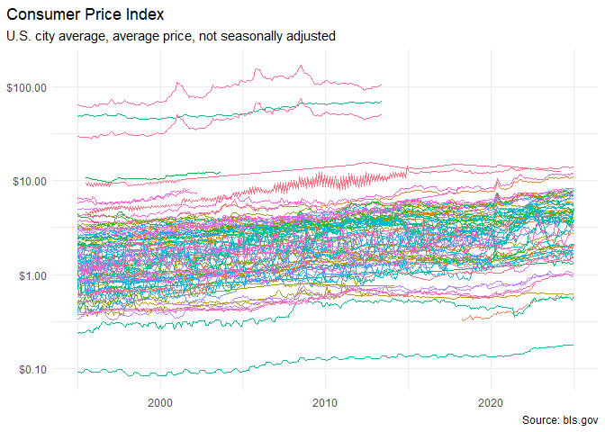

``` r
# add_content_slide(too_many_color_log, "Legends and Colors")

too_many_color_log_extra_breaks <- too_many_color_log +
  scale_y_log10(labels = label_dollar(), n.breaks = 7)

too_many_color_log_extra_breaks
```


``` r
# add_content_slide(too_many_color_log_extra_breaks, "Legends and Colors")

selected_series <- c(
  "Utility (piped) gas - 100 therms",
  "Electricity per 500 KWH",
  "Utility (piped) gas - 40 therms",
  "Wine, red and white table, all sizes, any origin, per 1 liter (33.8 oz)",
  "Electricity per KWH",
  "Other"
)

color_scale <-  c(colorBlindness::PairedColor12Steps[2],
                  colorBlindness::PairedColor12Steps[11], 
                  colorBlindness::PairedColor12Steps[6],
                  colorBlindness::PairedColor12Steps[8],
                  colorBlindness::PairedColor12Steps[10],
                  "gray15")
names(color_scale) <- selected_series
# "#FFBF7F" "#FF7F00" "#FFFF99" "#FFFF32" "#B2FF8C" "#32FF00" "#A5EDFF" "#19B2FF" "#CCBFFF" "#654CFF" "#FF99BF" "#E51932"

better_colors <- full_cpi |>
  #group_by(series_id) |>
  nest(data = -series_id) |>
  mutate(mean = map_dbl(data, ~ mean(.x$cost, na.rm = TRUE))) |>
  arrange(desc(mean)) |>
  mutate(row = row_number()) |>
  unnest(data) |>
  ungroup() |>
  # mutate(max_row = max(row))
  mutate(label = case_when(row < 4 ~ series_title,
                           row == 6 ~ series_title,
                           (row / max(row)) == 1 ~ series_title,
                           TRUE ~ "Other"),
         label = str_remove(label, " in U.S. city average, average price, not seasonally adjusted"),
         color_alpha = case_when(label == "Other" ~ .5,
                                 TRUE ~ 1),
         path_label = case_when(label != "Other" ~ label),
         path_cost = case_when(label != "Other" ~ cost),
         path_vjust_log = case_when(str_detect(label, "40 therms") ~ 1.5,
                                str_detect(label, "500 KWH") ~ -.4,
                                TRUE ~ -1),
         path_vjust = case_when(str_detect(label, "per KWH") ~ 1,
                                str_detect(label, "40 therms") ~ 2,
                                str_detect(label, "100 therms") ~ 3.5,
                                TRUE ~ -1),
         path_hjust = case_when(str_detect(label, "500") ~ .2,
                                str_detect(label, "therms") ~ .8,
                                            TRUE ~ .5)
         ) |>
  ggplot(aes(x = year, y = cost, color = label, group = series_id)) +
  geom_line(aes(alpha = color_alpha)) +
  labs(title = "Consumer Price Index",
       subtitle =  "U.S. city average, average price, not seasonally adjusted",
       caption = "Source: bls.gov") +
  scale_y_log10(labels = label_dollar()) +
  scale_color_manual(values = color_scale) +
  guides(color = guide_legend(ncol = 2),
         alpha = "none") +
  theme_minimal() +
  theme(legend.position = "bottom",
        legend.byrow = TRUE,
        legend.title = element_blank(),
        axis.title = element_blank(),
        text = element_text(size = 24),
        plot.title.position = "plot",
        plot.caption.position = "plot")

better_colors
```

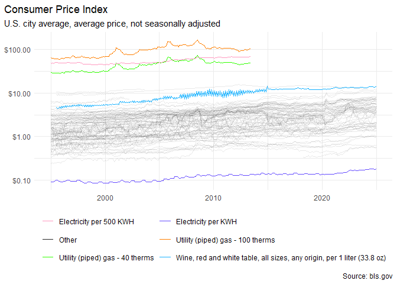

``` r
# add_content_slide(better_colors, "Legends and Colors")

better_labels <- better_colors +
  # geom_text(aes(label = "series_title")) +
  geomtextpath::geom_textline(aes(y = path_cost, 
                                  label = path_label,
                                  vjust = path_vjust_log,
                                  #hjust = path_hjust
                                  ), 
                              text_smoothing = 50) +
  theme(legend.position = "none",
        text = element_text(size = 24),
        plot.title.position = "plot",
        plot.caption.position = "plot")

better_labels
```

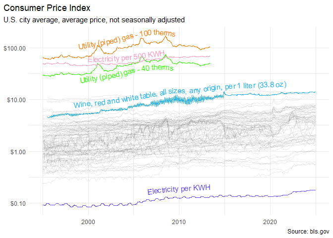

``` r
# add_content_slide(better_labels, "Legends and colors")

better_labels_no_log <- better_colors +
  # geom_text(aes(label = "series_title")) +
  geomtextpath::geom_textline(aes(y = path_cost, 
                                  label = path_label,
                                  vjust = path_vjust,
                                  hjust = path_hjust), 
                              text_smoothing = 64) +
  theme(legend.position = "none",
        text = element_text(size = 24),
        plot.title.position = "plot",
        plot.caption.position = "plot") +
  scale_y_continuous(labels = label_dollar())

better_labels_no_log
```

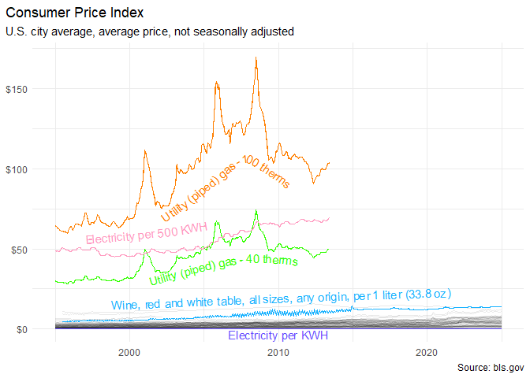

``` r
# add_content_slide(better_labels_no_log, "Legends and Colors") 
```

``` r
theme_set(theme_minimal())
theme_update(legend.title = element_blank(),
             text = element_text(size = 24),
             plot.title.position = "plot",
             plot.caption.position = "plot")

aubrey_exxon <- tibble(babies = c(1813, 1894, 1961, 2412, 3802, 4644, 5703, 5551, 5506, 7323, 8208, 8114, 7766, 7547, 6679, 6067, 5362, 4737, 4053, 3666, 3117),
                       exxon_stock = c(39.3, 35, 41.02, 51.02, 56.42, 76.26, 94.15, 80.06, 68.72, 73.72, 85.97, 87.79, 100.6, 92.25, 77.5, 90.94, 83.82, 67.35, 70.24, 41.45, 61.24),
                       year = 2002:2022)

fit_lm <- lm(babies ~ exxon_stock, data = aubrey_exxon)
reverse_fit_lm <- lm(exxon_stock ~ babies, data = aubrey_exxon)

# Excel Celestial palette #AC3EC1FF, #477BD1FF, #46B298FF, #90BA4CFF, #DD9D31FF, #E25247FF

aubrey_exxon_time_series <- aubrey_exxon |>
  mutate(exxon_stock = exxon_stock * fit_lm$coefficients[2] * 1 + fit_lm$coefficients[1]) |>
  rename("Exxon Stock" = "exxon_stock", "Babies Born" = "babies") |>
  pivot_longer(-c(year)) |>
  ggplot(aes(x = year, y = value, color = name)) +
  geom_line() +
  geom_point() +
  # scale_y_continuous(sec.axis = sec_axis(~ . * .01025 + 16.55, labels = scales::dollar)) +
  scale_y_continuous(sec.axis = sec_axis(
    ~ . * 
      reverse_fit_lm$coefficients[2] * 1 + 
      reverse_fit_lm$coefficients[1], 
    labels = scales::dollar,
    name = "Exxon Stock Price"),
    name = "\"Audrey's\" Born") +
  scale_color_manual(values = c("Babies Born" = "#90BA4CFF", "Exxon Stock" = "#DD9D31FF")) +
  xlab("Year") +
  labs(title = "Babies Born with the Name Aubrey vs the Price of Exxon Mobile Stock",
       caption = "Source: tylervigen.com/spurious-correlations")

aubrey_exxon_time_series
```

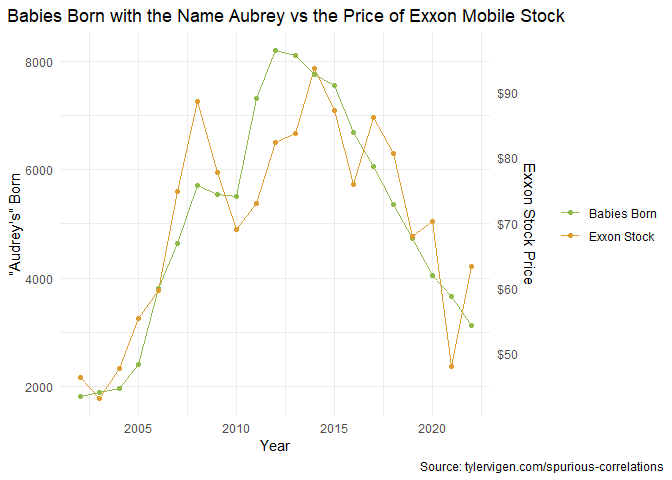

``` r
# add_content_slide(aubrey_exxon_time_series, "Accessible Colors") 
```

``` r
theme_set(theme_void())
theme_update(legend.position = "none",
             title = element_blank(),
             caption = element_blank(),
             text = element_text(size = 24),
             plot.title.position = "plot",
             plot.caption.position = "plot")

# colorBlindness::cvdPlot(aubrey_exxon_time_series + 
#                           theme_void() + 
#                           theme(legend.position = "none",
#                                 title = element_blank())
#                         )

cb_grid <- colorblindr::cvd_grid(aubrey_exxon_time_series)

cb_grid
```

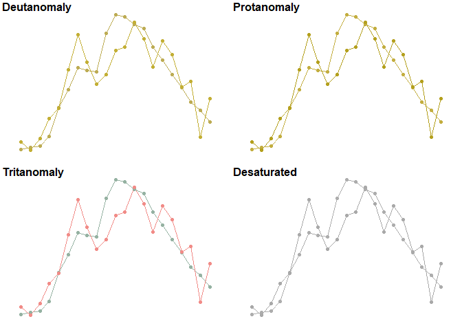

``` r
# add_content_slide(cb_grid, "Accessible Colors")

cb_density <- ggplot(iris, aes(Sepal.Length, fill = Species)) + 
  geom_density(alpha = 0.7)

cb_density
```

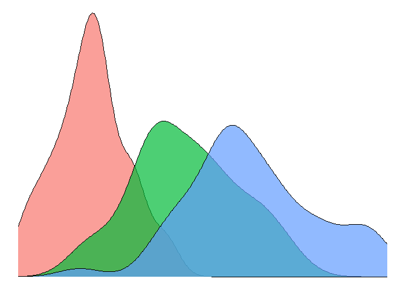

``` r
# add_content_slide(cb_density, "Accessible Colors")

# cb_density_grid <- colorblindr::cvd_grid(fig)
# 
# cb_density_grid

# add_content_slide(cb_density_grid, "Accessible Colors")
```

``` r
theme_set(theme_minimal())
theme_update(legend.title = element_blank(),
             text = element_text(size = 24),
             plot.title.position = "plot",
             plot.caption.position = "plot")
#theme(axis.title.y.left = )

trick_sec_axis <- function(data, multiple, intercept, title) {
  data |>
  mutate(exxon_stock = (exxon_stock * multiple) + intercept) |>
  rename("Exxon Stock" = "exxon_stock", "Babies Born" = "babies") |>
  pivot_longer(-c(year)) |>
  ggplot(aes(x = year, y = value, color = name)) +
  geom_line() +
  geom_point() +
  # scale_y_continuous(sec.axis = sec_axis(~ . * .01025 + 16.55, labels = scales::dollar)) +
  scale_y_continuous(sec.axis = sec_axis(
    ~ ((. - intercept)/multiple), 
    labels = scales::label_dollar(),
    name = "Exxon Stock Price"), 
    labels = scales::label_number(big.mark = ","),
    name = "\"Audrey's\" Born") +
  scale_color_manual(values = c("Babies Born" = "#90BA4CFF", "Exxon Stock" = "#DD9D31FF")) +
  xlab("Year") +
  labs(title = title,
       caption = "Source: tylervigen.com/spurious-correlations")
}

dual_one <- trick_sec_axis(data = aubrey_exxon, 
                           multiple = 10, 
                           intercept = 5000, 
                           "Exxon Stock Flat While Babies Named Audrey Volatile")

dual_one
```

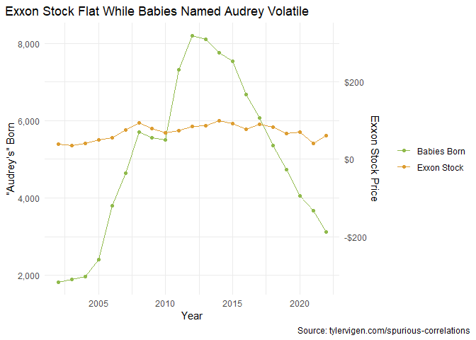

``` r
# add_content_slide(dual_one, "Dual-axis Pitfalls")

dual_two <- trick_sec_axis(data = aubrey_exxon, multiple = 2500, intercept = -100000, "Exxon Stock Volatile while Babes Named Audrey Unchanged")

dual_two
```

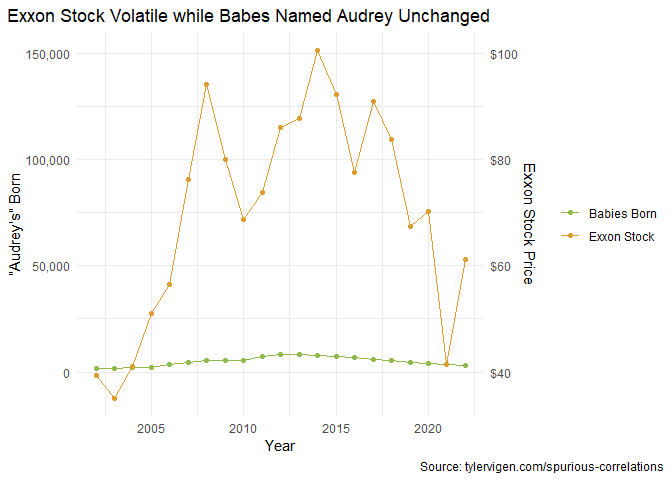

``` r
# add_content_slide(dual_two, "Dual-axis Pitfalls") 
```

``` r
scatter_example <- aubrey_exxon |>
  ggplot(aes(x = babies, y = exxon_stock, color = year)) +
  geom_point() +
  labs(title = "Exxon Stock Price vs. Babies Born Named Audrey",
       caption = "Source: tylervigen.com/spurious-correlations") +
  ylab("Exxon\nStock\nPrice") +
  xlab("Babies Born Named Audrey") +
  scale_y_continuous(labels = scales::label_dollar()) +
  scale_color_continuous(name = "Year") +
  theme(axis.title.y = element_text(angle = 0, vjust = .5))

scatter_example
```

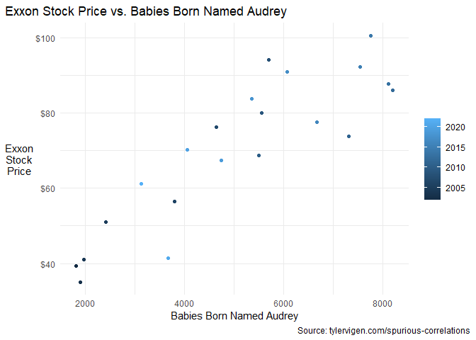

``` r
# add_content_slide(scatter_example, "Dual-axis Pitfalls")
```

``` r
# theme_update(axis.title.y.left = element_text(angle = 0, vjust = .5),
#              axis.title.y.right = element_text(angle = 0, vjust = .5))
theme_update(axis.text.x = element_text(angle = 90, hjust = 1, vjust = .5),
             legend.position = "right")

certifications <- tribble(
  ~cert, ~qty,
  "CMDA",     1130,
  "CCT",       747,
  "CFSQA",     794,
  "CMQ/OE",  8169,
  "CCQM",        6,
  "CQA",     13047,
  "CQE",     15566,
  "CQI",     16335,
  "CQT",     26777,
  "CRE",      3653,
  "MBB",       140,
  "CPGP",      544,
  "CQIA",    16769,
  "CQPA",     4266,
  "CSQE",     1263,
  "CSQP",     1310,
  "CSSBB",    9864,
  "CSSGB",   25138,
  "CSSYB",    4299
) |>
  arrange(desc(qty)) |>
  mutate(cert = as_factor(cert),
         roll_sum = cumsum(qty))

max_roll_sum <- max(certifications$roll_sum)

pareto <- certifications |>
  ggplot(aes(x = cert, y = qty, fill = cert, color = cert)) +
  geom_col() +
  geom_line(aes(y = roll_sum, group = NA)) +
  geom_point(aes(y = roll_sum)) +
  labs(title = "ASQ Certifications",
       caption = "Source: asq.org/cert/registry") +
  ylab("Quantity Certified") +
  xlab("Certification") +
  scale_y_continuous(labels = scales::label_number(big.mark = ","),
                     sec.axis = sec_axis(transform = ~ ./max_roll_sum,
                                         labels = scales::label_percent(),
                                         name = "Percent")) +
  guides(fill = guide_legend(ncol = 2)) +
  theme(legend.title = element_blank(),
        text = element_text(size = 24),
        plot.title.position = "plot",
        plot.caption.position = "plot")
  #scale_x_discrete(guide = guide_axis(n.dodge = 2))

pareto
```

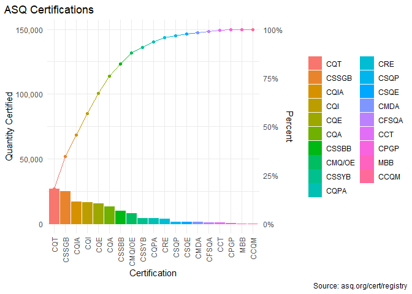

``` r
# add_content_slide(pareto, "Accessible Colors")
```

``` r
cb_pareto <- colorblindr::cvd_grid(pareto +
                        theme_void() +
                        theme(legend.position = "none",
                              text = element_text(size = 24),
                              plot.title = element_blank(),
                              plot.caption = element_blank()))

cb_pareto
```

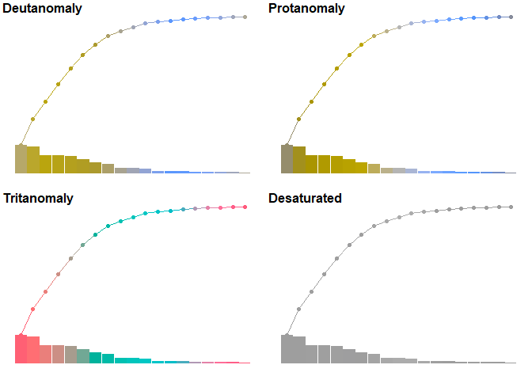

``` r
# add_content_slide(cb_pareto, "Accessible Colors")
```

## Dump the chart junk

``` r
theme_set(theme_minimal())
theme_update(legend.position = "none",
             text = element_text(size = 24),
             axis.text.x = element_text(angle = 90, hjust = 1, vjust = .5),
             plot.title.position = "plot",
             plot.caption.position = "plot")

clean_pareto_step_one <- certifications |>
  ggplot(aes(x = cert, y = qty)) +
  geom_col(fill = "#0b6bb5") +
  geom_line(aes(y = roll_sum, group = NA), color = "#0b6bb5") +
  geom_point(aes(y = roll_sum), color = "#0b6bb5") +
  labs(title = "ASQ Certifications",
       caption = "Source: asq.org/cert/registry") +
  ylab("Quantity Certified") +
  xlab("Certification") +
  scale_y_continuous(labels = scales::label_number(big.mark = ","),
                     sec.axis = sec_axis(transform = ~ ./max_roll_sum,
                                         labels = scales::label_percent(),
                                         name = "Percent"))
  #scale_x_discrete(guide = guide_axis(n.dodge = 2))

clean_pareto_step_one
```


``` r
# add_content_slide(clean_pareto_step_one, "Chart Junk")

theme_update(axis.title.y.left = element_text(angle = 0, vjust = .5, hjust = .5),
             #axis.text.x = element_text(angle = 0, vjust = .5, hjust = .5)
             axis.title.x = element_blank(),
             plot.title.position = "plot",
             plot.caption.position = "plot",
             panel.grid.major.x = element_blank()
             )

clean_pareto_step_two <- certifications |>
  mutate(cert = fct_other(cert, drop = c("MBB", "CPGP", "CCT", "CFSQA", "CMDA", "CSQE", "CSQP", "CCQM"))) |>
  group_by(cert) |>
  summarise(qty = sum(qty)) |>
  ungroup() |>
  mutate(roll_sum = cumsum(qty)) |>
  ggplot(aes(x = cert, y = qty/1000)) +
  geom_col(fill = "#0b6bb5") +
  geom_line(aes(y = roll_sum/1000, group = NA), color = "#0b6bb5") +
  geom_point(aes(y = roll_sum/1000), color = "#0b6bb5") +
  labs(title = "ASQ Certifications",
       caption = "Source: asq.org/cert/registry") +
  ylab("Quantity\nCertified") +
  scale_y_continuous(labels = scales::label_number(big.mark = ",", suffix = "k"),
                     sec.axis = sec_axis(transform = ~ ./max_roll_sum * 1000,
                                         labels = scales::label_percent())) +
  scale_x_discrete(guide = guide_axis(n.dodge = 1))

clean_pareto_step_two
```

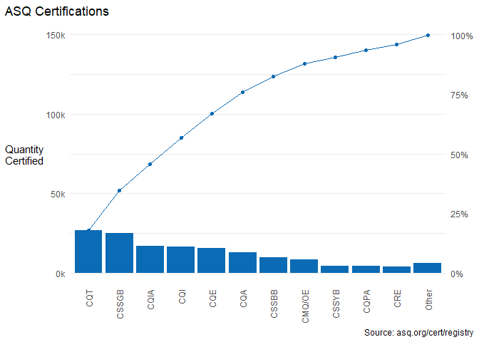

``` r
# add_content_slide(clean_pareto_step_two, "Chart Junk")
```
